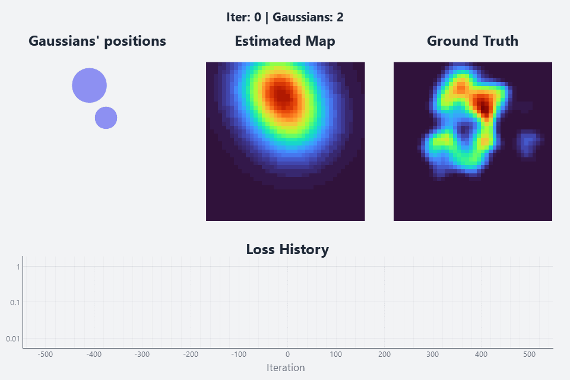
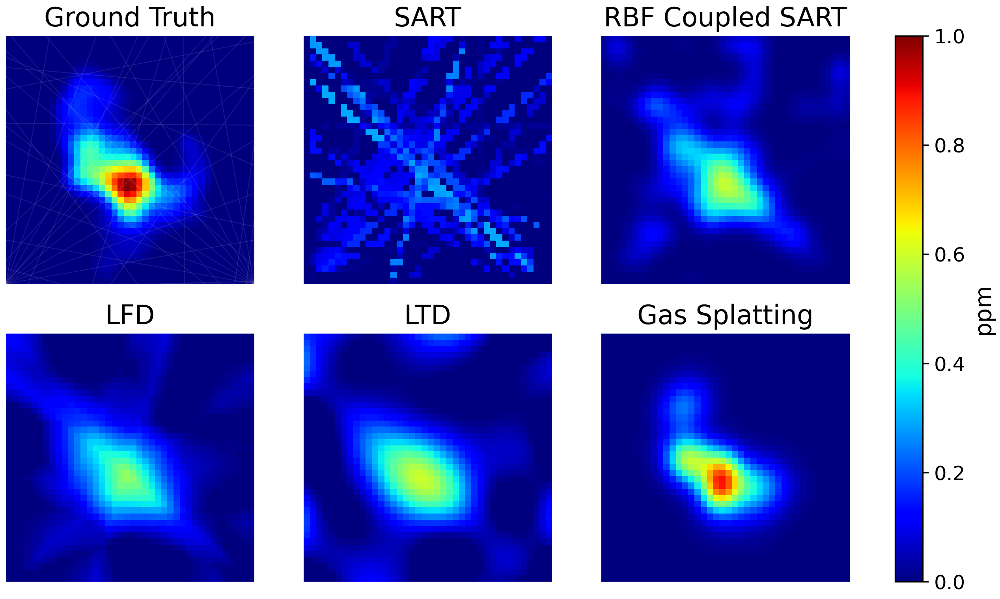

<h1 align="center">Gas Splatting</h1>

<p align="center">
  
  
</p>

<p align="center">
  
</p>
<p align="center"><i>Example of the Gas Splatting training evolution.</i></p>

## 📖 Overview

This repository contains the code for my Bachelor's Thesis (Trabajo de Fin de Grado - TFG). It presents a novel approach to gas distribution mapping by introducing **Gas Splatting**, a method based on Gaussian Splatting for 2D gas tomography using Tunable Diode Laser Absorption Spectroscopy (TDLAS) measurements.

The primary goal of this project is to accurately and efficiently reconstruct gas concentration maps by optimizing a set of 2D Gaussians through a differentiable pipeline.

## 📊 Performance Comparison

To evaluate the effectiveness of **Gas Splatting**, it is compared against traditional and state-of-the-art tomographic methods. The following results were obtained on a simulated 20x20m map with a grid resolution of 0.5m, using 40 TDLAS beams.

<p align="center">
  
</p>

| Method | RMSE ↓ | SSIM ↑ | Total Time (s) |
| :--- | :---: | :---: | :---: |
| SART | 0.1381 | 0.1481 | 1.19 |
| RBF Coupled SART | 0.0685 | 0.4623 | 1.30 |
| LFD | 0.0736 | 0.4788 | 1.24 |
| LTD | 0.0723 | 0.4760 | 1.23 |
| **Gas Splatting** | **0.0311** | **0.9045** | 3.51 |

*Note: While Gas Splatting requires slightly more computational time, it achieves a significantly higher reconstruction quality (SSIM) and lower error (RMSE) compared to baseline methods.*

## 🗂️ Repository Structure

```bash
gas_splatting/
├── real_data/          # Real-world TDLAS sweep datasets (JSON)
├── scripts/            # Benchmarks, experiments, and plotting scripts
├── utils/              # Math, plotting, sim, and core utilities
├── config.py           # simple_parsing configuration definitions
├── gs_model.py         # Gas Splatting model, densification logic 
├── main.py             # Main entry point (Sim -> Init -> Train)
└── trainer.py          # Optimization loop
```

## 🛠️ Installation

**1. Clone repository**
```bash
git clone https://github.com/aleevr04/gas_splatting.git
cd gas_splatting
```

**2. Create and activate a virtual environment**

The most convenient way to install dependencies is by creating a virtual environment. There are several tools for this purpose like `venv` or `conda`. A `venv` example is shown below:

```bash
# Linux / macOS
python3 -m venv .venv
source .venv/bin/activate

# Windows
python -m venv .venv
.venv\Scripts\activate
```

**3. Install PyTorch**

Since PyTorch is highly hardware-dependent (CPU or GPU), please install it by following the instructions from their [official website](https://pytorch.org/get-started/locally/). CPU-only example:

```bash
pip install torch torchvision --index-url https://download.pytorch.org/whl/cpu
```

**4. Install project dependencies**

```bash
pip install -r requirements.txt
```

<details>
<summary><h2>🚀 Usage</h2></summary>

### Standard Pipeline

To run the default simulation and training pipeline, simply execute the main script:

```bash
python main.py
```

This will generate simulation data (ground truth, beams geometry and measuremnts), initialize model parameters and start training.

### Experimental & Benchmarking Scripts

The `scripts/` directory contains various executable files designed to test, validate, and compare different aspects of the method:

* `compare_methods.py`: Compares Gas Splatting against state-of-the-art baselines. This script generates the visual reconstruction comparison grid shown in the performance section above.

* `densification_benchmark.py`: Runs benchmarks across multiple random seeds to compare the performance of a 3DGS-inspired adaptive densification strategy (split + clone) against our proposed approach, based exclusively on a split along the mayor axis.

* `densification_training.py`: Compares both densification strategies using a single seed, rendering the resulting gas maps alongside their loss functions and RMSE evolution plots.

* `long_axis_split.py`: Launches an interactive window featuring real-time sliders to visually inspect and tune the parameters of the proposed Gaussian splitting technique.

* `split_c_factor.py`: Generates an error-evolution graph evaluating the impact of the splitting factor parameter (c) within our custom densification strategy.

* `fractal_distribution.py`: A standalone script to generate gas distribution maps using the same fractal algorithm used in simulation ground truths. Great for experimenting with different map sizes, grid resolutions, and random seeds.

* `grid_resolution.py`: Performs an scaling experiment evaluating how Gas Splatting holds up against baseline methods as the grid cell resolution increases.

* `num_beams.py`: Runs a scaling benchmark evaluating reconstruction accuracy as the number of available TDLAS measurement beams increases.

* `test_real_data.py`: Validates the proposed Gas Splatting method against real-world TDLAS experimental data.

</details>


<details>
<summary><h2>⚙️ Configuration and CLI Options</h2></summary>

This project uses `simple_parsing` to dynamically handle configuration parameters from the command line. You can customize almost any aspect of the simulation, initialization, training, and densification processes.

To see a full list of available options for a given script, run:

```bash
python [script] --help
```

### Examples

Running a simulation with 50 TDLAS beams and changing the maximum training iterations to 2000:

```bash
python main.py --num_beams 50 --iterations 2000
```

Running grid resolution experiment with 20 seeds and a cell size of 0.5 meters:

```bash
python scripts/grid_resolution.py --num_seeds 20 --cell_size 0.5
```

Running training using different learning rates for position and concentration, launching the live visualization:

```bash
python main.py --pos_lr 0.005 --concentration_lr 0.002 --live_vis
```

> ⚠️ Important Note: Because configuration classes are shared across the entire project, some CLI options might not be applicable or will have no effect depending on the specific script you are executing. For example, changing the seed will not affect experiment scripts desinged to test different seeds.

</details>

## 📜 Acknowledgements and License

This project introduces custom implementations and novel features developed specifically for **Gas Splatting**. However, the core architecture and several foundational utilities are deeply inspired by and built upon the open-source repository [r2_gaussian](https://github.com/ruyi-zha/r2_gaussian), which in turn is a derivative of the original 3D Gaussian Splatting implementation by Inria and MPII.

Because this repository contains derivative work, it is distributed under the identical **Gaussian-Splatting License**. 

* **The software is provided strictly for non-commercial, research, and evaluation purposes.**
* Any commercial use requires prior and explicit consent from the original licensors (Inria/MPII).

For more details, please refer to the `LICENSE` file included in this repository.